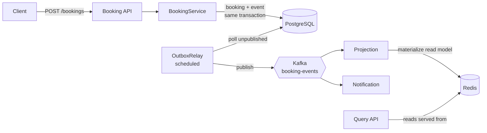

# SpaceFlow

Event-driven booking backend for shared spaces — coworking desks, meeting rooms, hot-desks.

[](https://github.com/firemoraster/spaceflow/actions)


I built this as a portfolio project, but I deliberately avoided the usual CRUD "todo app".
The goal was to implement the patterns I actually care about at a senior level —
**Transactional Outbox, CQRS, and idempotent event processing** — and to wire them up
end to end so the whole thing genuinely runs with a single `docker compose up`.

It's a modular monolith rather than a fleet of microservices: same architectural
discipline (each module is a hexagonal slice, modules talk only through events or
published ports), but you can clone it and run it without an orchestration platform.
When a module needs to become its own service, the seam is already there.

## How a booking flows through the system



The write side never talks to Kafka directly. It writes the booking **and** the
`BookingCreated` event to an `outbox` table in the *same* database transaction, so
there's no "saved the row but the broker was down" inconsistency. A scheduled relay
then ships outbox rows to Kafka and marks them published only after the broker acks.
Two independent consumers pick them up: one projects a read model into Redis, the
other sends notifications.

## The parts I think are worth reading

- **Transactional Outbox** — [`OutboxRelay`](src/main/java/com/spaceflow/shared/outbox/OutboxRelay.java)
  polls unpublished rows, publishes at-least-once, and only flags a row published
  after the send is acked. If the broker is down the transaction rolls back and the
  row is retried on the next tick.
- **CQRS** — writes go to PostgreSQL with optimistic locking; reads
  ([`BookingQueryController`](src/main/java/com/spaceflow/booking/adapters/in/web/BookingQueryController.java))
  are served entirely from a Redis read model that a Kafka consumer keeps up to date.
- **Idempotency by construction** — the Redis projection stores views in per-resource
  and per-user SETs keyed by identical JSON, so replaying an event is a no-op. Every
  message also carries a `messageId` header, and consumers with real side effects
  (notifications) claim it in a
  [`ProcessedMessageLedger`](src/main/java/com/spaceflow/shared/messaging/ProcessedMessageLedger.java)
  — an `INSERT ... ON CONFLICT DO NOTHING` in the same transaction — so a redelivered
  event is skipped, while a failed attempt rolls back and is retried.
- **No double-booking** — overlap is checked in SQL and the `Booking` aggregate carries
  a JPA `@version`, so two concurrent requests for the same slot can't both commit.
- **Outbox never uses `ddl-auto`** — schema is owned by Flyway migrations.

## Tech stack

| Area          | Choice                                                  |
|---------------|---------------------------------------------------------|
| Language      | Java 17 — records, sealed intent, pattern matching, streams |
| Framework     | Spring Boot 3.3 (Web, Data JPA, Security, Actuator)     |
| Write store   | PostgreSQL + Flyway                                     |
| Read store    | Redis                                                   |
| Messaging     | Apache Kafka (KRaft, no ZooKeeper)                      |
| Security      | OAuth2 login + JWT resource server (permissive `dev` profile for local runs) |
| API docs      | OpenAPI 3 / Swagger UI                                  |
| Observability | Actuator + Micrometer + Prometheus + Grafana           |
| Tests         | JUnit 5 + Testcontainers                                |
| CI            | GitHub Actions                                          |

## Running it

Everything, in one command:

```bash
cp .env.example .env            # tweak secrets if you like; defaults work
docker compose up -d --build
```

That brings up the app plus PostgreSQL, Redis, Kafka, Prometheus and Grafana. The app
runs under the `dev` profile, which disables auth so you can poke at it immediately.

Prefer to run the app from your IDE and only containerize the infra?

```bash
docker compose up -d postgres redis kafka
./mvnw spring-boot:run -Dspring-boot.run.profiles=dev
```

`./mvnw` is committed, so all you need installed is a JDK 17.

| What        | Where                                       |
|-------------|---------------------------------------------|
| Swagger UI  | http://localhost:8080/swagger-ui            |
| Health      | http://localhost:8080/actuator/health       |
| Metrics     | http://localhost:8080/actuator/prometheus   |
| Prometheus  | http://localhost:9090                       |
| Grafana     | http://localhost:3000 (admin / admin)       |

## Trying the API

Create a booking (dev profile, no token needed):

```bash
curl -i -X POST http://localhost:8080/api/v1/bookings \
  -H 'Content-Type: application/json' \
  -d '{
        "resourceId": "11111111-1111-1111-1111-111111111111",
        "startAt": "2026-08-01T09:00:00Z",
        "endAt":   "2026-08-01T10:00:00Z"
      }'
```

You get `201 Created` with a `Location` header. A moment later (after the relay ticks
and the projection consumes the event) the read model is populated:

```bash
curl "http://localhost:8080/api/v1/resources/11111111-1111-1111-1111-111111111111/availability?date=2026-08-01"
```

Book the same slot twice and the second call comes back `409 Conflict`.

## Testing

```bash
./mvnw verify
```

Unit tests run everywhere; integration tests spin up real PostgreSQL and Kafka via
Testcontainers, so they need a running Docker daemon.

## A few decisions & trade-offs

- **Monolith over microservices** — for a project this size, microservices would be
  cosplay. Module boundaries and event contracts give me the interesting distributed
  problems (eventual consistency, idempotency) without the ops overhead.
- **Polling relay over Debezium/CDC** — a scheduled poller is simple to read and
  reason about. Log-based CDC is the natural next step if throughput demanded it.
- **At-least-once, not exactly-once** — the broker side is at-least-once and consumers
  are made idempotent, which is the honest way to get effectively-once behaviour.

## Status & roadmap

- [x] Hexagonal booking slice, PostgreSQL schema via Flyway
- [x] Transactional Outbox + Kafka publisher (at-least-once)
- [x] CQRS read-model projection in Redis
- [x] Notification consumer
- [x] One-command Docker stack + Maven wrapper
- [x] GitHub Actions CI (build + tests on every push)
- [x] Idempotent consumer with a processed-message ledger
- [ ] Grafana dashboard for JVM + booking metrics
- [ ] `resource` module (capacity, locations) fleshed out

This is an active work in progress — I'm building it in vertical slices, one pattern
at a time.

## License

MIT — see [LICENSE](LICENSE).
